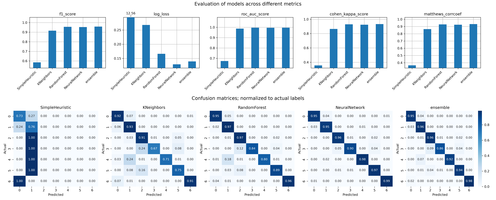

# Covertype Classification

Comparison of various Machine Learning models trained on the [Covertype dataset](https://archive.ics.uci.edu/ml/datasets/Covertype) together with a simple REST API to interact with them.

## Training and deployment scripts:
   * covertype_classification.py - a script to train the models and provide adequate evaluation charts
   * api.py - a Flask app for interacting with the models via REST API

## The models
There are four models, namely:
   * OneR - predicts one of two dominant classes based on a single feature.
   * KNeighbours from the scikit-learn library [[link](https://scikit-learn.org/stable/modules/generated/sklearn.neighbors.KNeighborsClassifier.html)]
   * Random Forest [[scikit-learn link](https://scikit-learn.org/stable/modules/generated/sklearn.ensemble.RandomForestClassifier.html)]
   * Neural Network consisting of a sequence of Dense -> BatchNormalization -> Dropout layers, preceded  by categorical embeddings 

This repository does not include pretrained sklearn's models.

## Comparison
The comparison also contains an unweighted ensemble of three models (KNeighbors, Random Forest and Neural Net). The hyperparameter values for generating this chart can be found in covertype_classification.py.

   

